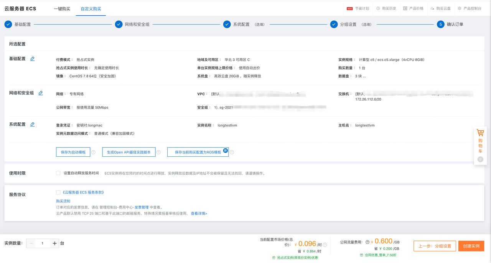

### lvm是什么？
LVM 是 Logical Volume Manager（逻辑卷管理）的简写，它是Linux环境下对磁盘分区进行管理的一种机制，它由Heinz Mauelshagen在Linux 2.4内核上实现，最新版本为：稳定版1.0.5，开发版 1.1.0-rc2，以及LVM2开发版。Linux用户安装Linux操作系统时遇到的一个常见的难以决定的问题就是如何正确地评估各分区大小，以分配合适的硬盘空间。普通的磁盘分区管理方式在逻辑分区划分好之后就无法改变其大小，当一个逻辑分区存放不下某个文件时，这个文件因为受上层文件系统的限制，也不能跨越多个分区来存放，所以也不能同时放到别的磁盘上。而遇到出现某个分区空间耗尽时，解决的方法通常是使用符号链接，或者使用调整分区大小的工具，但这只是暂时解决办法，没有从根本上解决问题。随着Linux的逻辑卷管理功能的出现，这些问题都迎刃而解，用户在无需停机的情况下可以方便地调整各个分区大小。


### 实验操作
创建设备


#### 查看磁盘状态

```shell
[root@longtestlvm ~]# fdisk -l

磁盘 /dev/vda：21.5 GB, 21474836480 字节，41943040 个扇区
Units = 扇区 of 1 * 512 = 512 bytes
扇区大小(逻辑/物理)：512 字节 / 512 字节
I/O 大小(最小/最佳)：512 字节 / 512 字节
磁盘标签类型：dos
磁盘标识符：0x000bb9c1

   设备 Boot      Start         End      Blocks   Id  System
/dev/vda1   *        2048    41943039    20970496   83  Linux

磁盘 /dev/vdb：21.5 GB, 21474836480 字节，41943040 个扇区
Units = 扇区 of 1 * 512 = 512 bytes
扇区大小(逻辑/物理)：512 字节 / 512 字节
I/O 大小(最小/最佳)：512 字节 / 512 字节


磁盘 /dev/vdc：21.5 GB, 21474836480 字节，41943040 个扇区
Units = 扇区 of 1 * 512 = 512 bytes
扇区大小(逻辑/物理)：512 字节 / 512 字节
I/O 大小(最小/最佳)：512 字节 / 512 字节


磁盘 /dev/vdd：21.5 GB, 21474836480 字节，41943040 个扇区
Units = 扇区 of 1 * 512 = 512 bytes
扇区大小(逻辑/物理)：512 字节 / 512 字节
I/O 大小(最小/最佳)：512 字节 / 512 字节
```

#### 升级yum

```shell
[root@longtestlvm ~]# yum update -y
```

#### 安装lvm2
```shell
[root@longtestlvm ~]# yum install lvm2 -y
```

#### 创建物理卷
```shell
[root@longtestlvm ~]# pvcreate /dev/vdb /dev/vdc
  Physical volume "/dev/vdb" successfully created.
  Physical volume "/dev/vdc" successfully created.
```

#### 查看物理卷

```shell
[root@longtestlvm ~]# pvdisplay
  "/dev/vdc" is a new physical volume of "20.00 GiB"
  --- NEW Physical volume ---
  PV Name               /dev/vdc
  VG Name
  PV Size               20.00 GiB
  Allocatable           NO
  PE Size               0
  Total PE              0
  Free PE               0
  Allocated PE          0
  PV UUID               avPba4-Z0J5-bhWC-4poS-x5oG-qt4P-4xUJnn

  "/dev/vdb" is a new physical volume of "20.00 GiB"
  --- NEW Physical volume ---
  PV Name               /dev/vdb
  VG Name
  PV Size               20.00 GiB
  Allocatable           NO
  PE Size               0
  Total PE              0
  Free PE               0
  Allocated PE          0
  PV UUID               exRn9W-AQKP-7rTc-EwAf-YtsK-MW0O-HHJ0sk
```


#### 查看物理卷简要信息
```shell
[root@longtestlvm ~]# pvs
  PV         VG Fmt  Attr PSize  PFree
  /dev/vdb      lvm2 ---  20.00g 20.00g
  /dev/vdc      lvm2 ---  20.00g 20.00g
```

#### 查看物理卷简要信息
```shell
[root@longtestlvm ~]# pvscan
  PV /dev/vdc                      lvm2 [20.00 GiB]
  PV /dev/vdb                      lvm2 [20.00 GiB]
  Total: 2 [40.00 GiB] / in use: 0 [0   ] / in no VG: 2 [40.00 GiB]
``` 

#### 创建逻辑卷组
```shell
[root@longtestlvm ~]# vgcreate vglong /dev/vdc /dev/vdb
  Volume group "vglong" successfully created
``` 

查看逻辑卷组信息
```shell
[root@longtestlvm ~]# vgdisplay
  --- Volume group ---
  VG Name               vglong
  System ID
  Format                lvm2
  Metadata Areas        2
  Metadata Sequence No  1
  VG Access             read/write
  VG Status             resizable
  MAX LV                0
  Cur LV                0
  Open LV               0
  Max PV                0
  Cur PV                2
  Act PV                2
  VG Size               39.99 GiB
  PE Size               4.00 MiB
  Total PE              10238
  Alloc PE / Size       0 / 0
  Free  PE / Size       10238 / 39.99 GiB
  VG UUID               4flIRX-1oVR-MBy5-I2YT-gY2R-Eqaf-PmFq7b
```

#### 查看逻辑卷组简要信息
```shell
[root@longtestlvm ~]# vgs
  VG     #PV #LV #SN Attr   VSize  VFree
  vglong   2   0   0 wz--n- 39.99g 39.99g
```

#### 创建逻辑卷
```shell
[root@longtestlvm ~]# lvcreate -L 30G -n lvlong vglong
  Logical volume "lvlong" created.
```

#### 查看逻辑卷
```shell
[root@longtestlvm ~]# lvdisplay
  --- Logical volume ---
  LV Path                /dev/vglong/lvlong
  LV Name                lvlong
  VG Name                vglong
  LV UUID                x7iFjg-QSem-vzfu-jAkV-V0lI-50P3-tHD3Hz
  LV Write Access        read/write
  LV Creation host, time longtestlvm, 2021-10-12 14:00:09 +0800
  LV Status              available
  # open                 0
  LV Size                30.00 GiB
  Current LE             7680
  Segments               2
  Allocation             inherit
  Read ahead sectors     auto
  - currently set to     8192
  Block device           252:0
```

#### 查看逻辑卷简要信息
```shell
[root@longtestlvm ~]# lvs
  LV     VG     Attr       LSize  Pool Origin Data%  Meta%  Move Log Cpy%Sync Convert
  lvlong vglong -wi-a----- 30.00g
```

#### 查看磁盘
```shell
[root@longtestlvm ~]# fdisk -l

磁盘 /dev/vda：21.5 GB, 21474836480 字节，41943040 个扇区
Units = 扇区 of 1 * 512 = 512 bytes
扇区大小(逻辑/物理)：512 字节 / 512 字节
I/O 大小(最小/最佳)：512 字节 / 512 字节
磁盘标签类型：dos
磁盘标识符：0x000bb9c1

   设备 Boot      Start         End      Blocks   Id  System
/dev/vda1   *        2048    41943039    20970496   83  Linux

磁盘 /dev/vdb：21.5 GB, 21474836480 字节，41943040 个扇区
Units = 扇区 of 1 * 512 = 512 bytes
扇区大小(逻辑/物理)：512 字节 / 512 字节
I/O 大小(最小/最佳)：512 字节 / 512 字节


磁盘 /dev/vdc：21.5 GB, 21474836480 字节，41943040 个扇区
Units = 扇区 of 1 * 512 = 512 bytes
扇区大小(逻辑/物理)：512 字节 / 512 字节
I/O 大小(最小/最佳)：512 字节 / 512 字节


磁盘 /dev/vdd：21.5 GB, 21474836480 字节，41943040 个扇区
Units = 扇区 of 1 * 512 = 512 bytes
扇区大小(逻辑/物理)：512 字节 / 512 字节
I/O 大小(最小/最佳)：512 字节 / 512 字节


磁盘 /dev/mapper/vglong-lvlong：32.2 GB, 32212254720 字节，62914560 个扇区
Units = 扇区 of 1 * 512 = 512 bytes
扇区大小(逻辑/物理)：512 字节 / 512 字节
I/O 大小(最小/最佳)：512 字节 / 512 字节
```

#### 格式化虚拟磁盘
```shell
[root@longtestlvm ~]# mkfs.ext4 /dev/vglong/lvlong
mke2fs 1.42.9 (28-Dec-2013)
文件系统标签=
OS type: Linux
块大小=4096 (log=2)
分块大小=4096 (log=2)
Stride=0 blocks, Stripe width=0 blocks
1966080 inodes, 7864320 blocks
393216 blocks (5.00%) reserved for the super user
第一个数据块=0
Maximum filesystem blocks=2155872256
240 block groups
32768 blocks per group, 32768 fragments per group
8192 inodes per group
Superblock backups stored on blocks:
        32768, 98304, 163840, 229376, 294912, 819200, 884736, 1605632, 2654208,
        4096000

Allocating group tables: 完成
正在写入inode表: 完成
Creating journal (32768 blocks): 完成
Writing superblocks and filesystem accounting information: 完成
``` 

#### 挂载磁盘
```shell
[root@longtestlvm mnt]# mkdir longtestlvm

[root@longtestlvm mnt]# mount /dev/mapper/vglong-lvlong /mnt/longtestlvm/
```


#### 创建一个文件试试
```shell
[root@longtestlvm longtestlvm]# mkdir -p /mnt/longtestlvm/longtest

[root@longtestlvm longtestlvm]# echo 'hello world \n nihao a' > /mnt/longtestlvm/longtest/a.txt
```

#### 查看磁盘挂载
```shell
[root@longtestlvm mnt]# df -h
文件系统                   容量  已用  可用 已用% 挂载点
devtmpfs                   3.9G     0  3.9G    0% /dev
tmpfs                      3.9G     0  3.9G    0% /dev/shm
tmpfs                      3.9G  572K  3.9G    1% /run
tmpfs                      3.9G     0  3.9G    0% /sys/fs/cgroup
/dev/vda1                   20G  2.4G   17G   13% /
tmpfs                      783M     0  783M    0% /run/user/0
/dev/mapper/vglong-lvlong   30G   45M   28G    1% /mnt/longtestlvm
```

#### 查看文件大小
```shell
[root@longtestlvm mnt]# du -ah
4.0K        ./longtestlvm/longtest/a.txt
8.0K        ./longtestlvm/longtest
16K        ./longtestlvm/lost+found
28K        ./longtestlvm
32K        .
```

#### 扩展逻辑卷容量
```shell
[root@longtestlvm ~]# lvextend -L +4G /dev/vglong/lvlong
  Size of logical volume vglong/lvlong changed from 30.00 GiB (7680 extents) to 34.00 GiB (8704 extents).
  Logical volume vglong/lvlong successfully resized.
```

#### resize逻辑卷
```shell
[root@longtestlvm ~]# resize2fs /dev/vglong/lvlong
resize2fs 1.42.9 (28-Dec-2013)
Filesystem at /dev/vglong/lvlong is mounted on /mnt/longtestlvm; on-line resizing required
old_desc_blocks = 4, new_desc_blocks = 5
The filesystem on /dev/vglong/lvlong is now 8912896 blocks long.
```

#### 扩展逻辑卷组
```shell
[root@longtestlvm ~]# vgextend vglong /dev/vdd
  Physical volume "/dev/vdd" successfully created.
  Volume group "vglong" successfully extended
```

#### 缩减逻辑卷
```shell
[root@longtestlvm ~]# umount /mnt/longtestlvm

[root@longtestlvm ~]# e2fsck -f /dev/vglong/lvlong
e2fsck 1.42.9 (28-Dec-2013)
第一步: 检查inode,块,和大小
第二步: 检查目录结构
第3步: 检查目录连接性
Pass 4: Checking reference counts
第5步: 检查簇概要信息
/dev/vglong/lvlong: 13/2228224 files (0.0% non-contiguous), 184932/8912896 blocks


[root@longtestlvm ~]#  resize2fs /dev/vglong/lvlong  10G
resize2fs 1.42.9 (28-Dec-2013)
Resizing the filesystem on /dev/vglong/lvlong to 2621440 (4k) blocks.
The filesystem on /dev/vglong/lvlong is now 2621440 blocks long.


[root@longtestlvm ~]# lvresize -L 10G /dev/vglong/lvlong
  WARNING: Reducing active logical volume to 10.00 GiB.
  THIS MAY DESTROY YOUR DATA (filesystem etc.)
Do you really want to reduce vglong/lvlong? [y/n]: y
  Size of logical volume vglong/lvlong changed from 34.00 GiB (8704 extents) to 10.00 GiB (2560 extents).
  Logical volume vglong/lvlong successfully resized.
```

#### 缩减逻辑卷组
```shell
[root@longtestlvm ~]# vgreduce vglong /dev/vdd
```

#### 查看逻辑卷组
```shell
[root@longtestlvm ~]# vgdisplay
  --- Volume group ---
  VG Name               vglong
  System ID
  Format                lvm2
  Metadata Areas        2
  Metadata Sequence No  10
  VG Access             read/write
  VG Status             resizable
  MAX LV                0
  Cur LV                1
  Open LV               0
  Max PV                0
  Cur PV                2
  Act PV                2
  VG Size               39.99 GiB
  PE Size               4.00 MiB
  Total PE              10238
  Alloc PE / Size       2560 / 10.00 GiB
  Free  PE / Size       7678 / 29.99 GiB
  VG UUID               4flIRX-1oVR-MBy5-I2YT-gY2R-Eqaf-PmFq7b
```

#### 删除
```shell
[root@longtestlvm ~]# lvremove /dev/vglong/lvlong
Do you really want to remove active logical volume vglong/lvlong? [y/n]: y
  Logical volume "lvlong" successfully removed

[root@longtestlvm ~]# vgremove vglong
  Volume group "vglong" successfully removed
  
[root@longtestlvm ~]# pvremove /dev/vdb /dev/vdc /dev/vdd
  Labels on physical volume "/dev/vdb" successfully wiped.
  Labels on physical volume "/dev/vdc" successfully wiped.
  Labels on physical volume "/dev/vdd" successfully wiped.
```

#### 迁移
```shell
[root@longtestlvm ~]# pvmove /dev/vdb /dev/vdc
```


#### 一些其他的内容
disk相关命令
fdisk 、 mkfs 、du 、 df 、dump2fs


#### 一些问题记录
1. 已经将某个物理磁盘加入到 vg 中后，再将该物理盘进行分区
```shell
[root@longtestlvm ~]# pvs
  WARNING: Device for PV cSASFg-dS4S-lrIP-hD3V-aJSR-EnzC-5bYp4B not found or rejected by a filter.
  Couldn't find device with uuid cSASFg-dS4S-lrIP-hD3V-aJSR-EnzC-5bYp4B.
  PV         VG     Fmt  Attr PSize   PFree
  /dev/vdb   vglong lvm2 a--  <20.00g <20.00g
  /dev/vdc   vglong lvm2 a--  <20.00g <20.00g
  /dev/vdd1         lvm2 ---  100.00m 100.00m
  /dev/vdd2         lvm2 ---  100.00m 100.00m
  [unknown]  vglong lvm2 a-m  <20.00g <20.00g
```

解决办法：
```shell
[root@longtestlvm ~]# vgreduce --removemissing vglong --force
  Volume group "vglong" is already consistent.
  

[root@longtestlvm ~]# pvs
  PV         VG     Fmt  Attr PSize   PFree
  /dev/vdb   vglong lvm2 a--  <20.00g <20.00g
  /dev/vdc   vglong lvm2 a--  <20.00g <20.00g
  /dev/vdd1         lvm2 ---  100.00m 100.00m
  /dev/vdd2         lvm2 ---  100.00m 100.00m
```

#### 整体的一些想法
对于 lvm，可以用于多个磁盘组合成一个磁盘，且提供 raid 能力，这给存储提供了超大容量的可能性，可以考虑作为NAS的一种实现。
